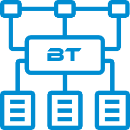

<p align="center">
    
</p>


# Реализация BehaviourTree

> **ВАЖНО!** Требует C#9 (или Unity >=2021.2).

> **ВАЖНО!** Не забывайте использовать `DEBUG`-версии билдов для разработки и `RELEASE`-версии билдов для релизов: все внутренние проверки/исключения будут работать только в `DEBUG`-версиях и удалены для увеличения производительности в `RELEASE`-версиях.

> **ВАЖНО!** Проверено на Unity 2021.3 (не зависит от нее) и содержит asmdef-описания для компиляции в виде отдельных сборок и уменьшения времени рекомпиляции основного проекта.


# Социальные ресурсы
[Официальный блог](https://leopotam.com)


# Установка


## В виде исходников
Поддерживается установка в виде исходников из архива, который надо распаковать в проект.


## Прочие источники
Официальные версии выпускаются для активных подписчиков в виде ссылок на актуальные версии.


# Основные типы 

## Дерево

Дерево поведения состоит из произвольного набора типизированных узлов. Каждый узел может являться корнем дерева и выполняться как единое целое со всеми вложенными узлами. Для упрощения сборки существует специальный тип `BtNodes<>`, который уменьшает количество повторяющегося кода:
```c#
// Хранилище данных, которыми будет оперировать дерево.
class Data {
    public int Counter;
}
// Инициализация специального типа для упрощения кода.
BtNodes<Data> bt;
// Создаем дерево.
var root = bt.Seq (
    bt.Act ((d) {
        d.Counter += 123;
        return BtResult.True;
    })
);
// Создаем экземпляр хранилища.
Data data = new ();
BtResult res = root.Run (data);
```

## Узел дерева
Узел - минимальная единица управления деревом. Принимает на вход данные определенного типа и возвращает успешность их обработки. Обработка может занимать несколько вызовов, в этом случае узел возвращает специальный результат `BtResult.Pending` - в момент следующего запуска обработка продолжится с места прерывания. Запуск узла выполняется через метод `IBtNode.Run()`. Если требуется указать, что дерево не может выполняться дальше из-за возникшей ошибки - узел должен вернуть результат `BtResult.Error`.

> **Важно** Если при выполнении вернулся результат `BtResult.Pending` или `BtResult.Error`, но дальше выполнять не требуется (или не возможно в случае `BtResult.Error`), то внутреннее состояние всей иерархии узлов можно сбросить через вызов `IBtNode.Reset()` у корневого узла.

Каждый узел при обработке данных возвращает один из результатов:
* `True` - операция успешна, можно переходить к следующему узлу.
* `False` - операция не успешна, обычно означает необходимость прерывания.
* `Pending` - операция не может быть завершена за текущий вызов, необходимо продолжить обработку в следующем вызове.
* `Error` - операция не может быть завершена и дальнейшее выполнение невозможно, дерево находится в состоянии ошибки.

Результат по сути является сигналом - можно ли продолжать обрабатывать следующие узлы дерева.

> **Важно** В зависимости от типа узла результаты обработки могут менять смысл: прерывать поток выполнения (работает как `break/return`), играть роль условия для проверки и т.д.


# Готовые узлы
В пакете присутствуют следующие базовые узлы:


## BtAct - пользовательский код
Принимает на вход анонимную функцию или метод:
```c#
// Полная запись.
new BtAct<Data> (OnNodeCalled);
// Короткая запись.
BtNodes<Data> bt;
bt.Act (OnNodeCalled);
...
BtResult OnNodeCalled (Data data) {
    return BtResult.True;
}
```
Если результат `BtResult.False`, то он возвращается в вызывающую ноду и может быть как условием проверки условия, так и прерывателем потока выполнения последовательности.


## BtAnd - логическое AND результатов работы узлов
Принимает на вход 2 узла и возвращает AND от результатов их работы. `BtResult.Pending` возвращается как есть:
```c#
// Полная запись.
new BtAnd<Data> (nodeA, nodeB);
// Короткая запись.
BtNodes<Data> bt;
bt.And (nodeA, nodeB)
```


## BtIf - условный оператор
Принимает на вход 3 узла - условие для проверки, узел для выполнения в случае успешности проверки и узел для выполнения в случае провала проверки. Логика работы схожа с работой `if A then B else C`:
```c#
// Полная запись.
new BtIf<Data> (nodeForCheck, nodeOnTrue, nodeOnFalse);
// Короткая запись.
BtNodes<Data> bt;
bt.If (nodeForCheck, nodeOnTrue, nodeOnFalse);
```
Если результат `BtResult.False` возвращается из вложенных узлов `nodeOnTrue` или `nodeOnFalse`, то это означает прерывание соответствующего узла, сам же узел `BtIf` считается корректно завершенным и возвращает `BtResult.True`
> **Важно** Этот узел не может в принципе вернуть `BtResult.False`.


## BtNeg - инверсия результата работы узла
Принимает на вход узел и инвертирует результаты его работы. `BtResult.Pending` возвращается как есть:
```c#
// Полная запись.
new BtNeg<Data> (nodeForNeg);
// Короткая запись.
BtNodes<Data> bt;
bt.Neg (nodeForNeg)
```


## BtOr - логическое OR результатов работы узлов
Принимает на вход 2 узла и возвращает OR от результатов их работы. `BtResult.Pending` возвращается как есть:
```c#
// Полная запись.
new BtOr<Data> (nodeA, nodeB);
// Короткая запись.
BtNodes<Data> bt;
bt.Or (nodeA, nodeB)
```


## BtSelect - условный выбор одного из узлов
Принимает на вход неограниченное количество пар узлов `(nodeForCheck, nodeOnTrue)`, при запуске последовательно проверяются все `nodeForCheck` и в случае первой успешной проверки выполняется соответствующий узел `nodeOnTrue`:
```c#
// Полная запись.
new BtSelect<Data> (
    (nodeForCheck1, nodeOnTrue1),
    (nodeForCheck2, nodeOnTrue2)
);
// Короткая запись.
BtNodes<Data> bt;
bt.Select (
    (nodeForCheck1, nodeOnTrue1),
    (nodeForCheck2, nodeOnTrue2)
);
```
Если результат `BtResult.False` возвращается из вложенного узла `nodeOnTrue`, то это означает прерывание соответствующего узла, сам же узел `BtSelect` считается корректно завершенным и возвращает `BtResult.True`.
> **Важно** Этот узел не может в принципе вернуть `BtResult.False`.

Если ни один из проверяемых узлов не пройдет проверку, то узел `BtSelect` завершается с результатом `BtResult.True`.


## BtSeq - последовательность узлов
Принимает на вход неограниченное количество узлов, при запуске последовательно выполняет их:
```c#
// Полная запись.
new BtSeq<Data> (node1, node2, node3, node4);
// Короткая запись.
BtNodes<Data> bt;
bt.Seq (node1, node2, node3, node4);
```
Если результат `BtResult.False` возвращается из вложенного узла, то это означает прерывание работы (последующие узлы не выполняются), сам же узел `BtSeq` считается корректно завершенным и возвращает `BtResult.True`.
> **Важно** Этот узел не может в принципе вернуть `BtResult.False`. Если необходимо возвращать результат - вместо `BtSeq` следует использовать `BtSeqRet`.


## BtSeqRet - последовательность узлов с возвратом результата
Принимает на вход неограниченное количество узлов, при запуске последовательно выполняет их:
```c#
// Полная запись.
new BtSeqRet<Data> (node1, node2, node3, node4);
// Короткая запись.
BtNodes<Data> bt;
bt.SeqRet (node1, node2, node3, node4);
```
Если результат `BtResult.False` возвращается из вложенного узла, то это означает прерывание работы (последующие узлы не выполняются), сам же узел `BtSeqRet` возвращает полученное значение как результат своей работы.


## BtWhile - циклическое выполнение
Принимает на вход 2 узла: условие для проверки и узел, которвый будет выполняться пока проверка успешна:
```c#
// Полная запись.
new BtWhile<Data> (nodeForCheck, nodeOnTrue);
// Короткая запись.
BtNodes<Data> bt;
bt.While (nodeForCheck, nodeOnTrue);
```
Если результат `BtResult.False` возвращается из вложенного узла, то это означает прерывание работы, сам же узел `BtWhile` считается корректно завершенным и возвращает `BtResult.True`.
> **Важно** Этот узел не может в принципе вернуть `BtResult.False`.


# Создание своих типов узлов
Для этого необходимо реализовать интерфейс `IBtNode<>`:
```c#
public class BtMyNode<T> : IBtNode<T> where T : class {
    int _id;
    string _name;

    // Параметры рекомендуется передавать через конструктор.
    public BtMyNode (int id, string name) {
        _id = id;
        _name = name;
    }

    public void Reset () {
        // Метод служит для сброса любых динамических данных
        // в исходное состояние, применяется при сбросе состояния
        // дерева после возврата BtResult.Pending или BtResult.Error.
    }

    public BtResult Run (T data) {
        // Метод содержит логику работы узла и принимает
        // на вход экземпляр данных для обработки.
    }
}
```
Так же для удобства можно добавить его в `BtNodes<>` через метод-расширение:
```c#
public static partial class BtNodesExtensions {
    public static BtMyNode<T> MyNode<T> (this BtNodes<T> _, int id, string name) where T : class {
        return new (id, name);
    }
}
```


# Лицензия
Расширение выпускается под коммерческой лицензией, [подробности тут](./LICENSE.md).
