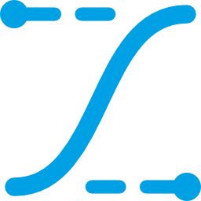

<p align="center">
    
</p>

# Easings - Набор функций сглаживания

> **ВАЖНО!** Требует C#9 (или Unity >=2021.2).

> **ВАЖНО!** Не забывайте использовать `DEBUG`-версии билдов для разработки и `RELEASE`-версии билдов для релизов: все внутренние проверки/исключения будут работать только в `DEBUG`-версиях и удалены для увеличения производительности в `RELEASE`-версиях.

> **ВАЖНО!** Проверено на Unity 2021.3 (не зависит от нее) и содержит asmdef-описания для компиляции в виде отдельных сборок и уменьшения времени рекомпиляции основного проекта.


# Социальные ресурсы
[Официальный блог](https://leopotam.com)


# Установка


## В виде исходников
Поддерживается установка в виде исходников из архива, который надо распаковать в проект.


## Прочие источники
Официальные версии выпускаются для активных подписчиков в виде ссылок на актуальные версии.


# Основные типы

## Варианты сглаживания
`Ease` - основной тип-перечисление, содержащий в себе следующие варианты сглаживания:
* Linear
* QuadIn
* QuadOut
* QuadInOut
* CubicIn
* CubicOut
* CubicInOut
* QuartIn
* QuartOut
* QuartInOut
* QuintIn
* QuintOut
* QuintInOut
* SineIn
* SineOut
* SineInOut
* BounceIn
* BounceOut
* BounceInOut
* BackIn
* BackOut
* BackInOut
* ElasticIn
* ElasticOut
* ElasticInOut

Каждый вариант сглаживания доступен через перечисление:
```c#
Ease e1 = Ease.Linear;
Ease e2 = Ease.ElasticIn;
```

## Вычисление результата
Для вычисления результата сглаживания существует 4 метода, различающиеся интерпретацией входящего параметра (ограничений на диапазон значений нет):
* Raw - вычисление без изменения входящего параметра, следует использовать только в качестве оптимизации и если известно, что значение параметра точно находится в [0;1]:
    ```c#
    float r1 = Ease.Linear.Raw (-0.5f);
    float r2 = Ease.Linear.Raw (0.5f);
    float r3 = Ease.Linear.Raw (1.5f);
    // r1 = -0.5f;
    // r2 = 0.5f;
    // r3 = 1.5f;
    ```
* Clamp - вычисление с обрезанием входящего параметра в [0;1]:
    ```c#
    float r1 = Ease.Linear.Clamp (-0.5f);
    float r2 = Ease.Linear.Clamp (0.5f);
    float r3 = Ease.Linear.Clamp (1.5f);
    // r1 = 0f;
    // r2 = 0.5f;
    // r3 = 1f;
    ```
* Repeat - вычисление с повторением (отбрасыванием целой части) входящего параметра в [0;1):
    ```c#
    float r1 = Ease.Linear.Repeat (-0.5f);
    float r2 = Ease.Linear.Repeat (0.1f);
    float r3 = Ease.Linear.Repeat (1.4f);
    // r1 = 0.5f;
    // r2 = 0.1f;
    // r3 = 0.4f;
    ```
* PingPong - вычисление с повторением (нарастание с 0 до 1 и возврат с 1 до 2) входящего параметра в [0;1):
    ```c#
    float r1 = Ease.Linear.PingPong (0.1f);
    float r2 = Ease.Linear.PingPong (1f);
    float r3 = Ease.Linear.PingPong (1.5f);
    float r4 = Ease.Linear.PingPong (2f);
    // r1 = 0.1f;
    // r2 = 1.0f;
    // r3 = 0.5f;
    // r4 = 0.0f;
    ```


# Лицензия
Расширение выпускается под коммерческой лицензией, [подробности тут](./LICENSE.md).
