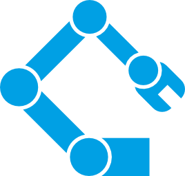

<p align="center">
    
</p>

# Поддержка инверсной кинематики

> **ВАЖНО!** Требует C#9 (или Unity >=2021.2).

> **ВАЖНО!** Проверено на Unity 2021.3 (не зависит от нее) и содержит asmdef-описания для компиляции в виде отдельных сборок и уменьшения времени рекомпиляции основного проекта.


# Социальные ресурсы
[Официальный блог](https://leopotam.com)


# Установка


## В виде исходников
Поддерживается установка в виде исходников из архива, который надо распаковать в проект.


## Прочие источники
Официальные версии выпускаются для активных подписчиков в виде ссылок на актуальные версии.


# Основные типы


## FabrikSolver2
Реализация инверсной кинематики в 2D методом прямого и обратного следования (FABRIK - Forward And Backward Reaching Inverse Kinematics).


Стартовая точка определяется следующим вызовом:
```c#
FabrikSolver2 ik = new ();
// Позиция точки в мировых координатах.
float posX = 12f;
float posY = 34f;
// Направление, относительно которого
// будет применяться ограничение на
// вращение для первого сегмента.
float dirX = 0f;
float dirY = 1f;
ik.SetBase (posX, posY, dirX, dirY);
```
> **ВАЖНО** Направление должно быть нормализовано, автоматическая нормализация не производится.


Новые сегменты с ограничениями по углам вращения добавляются следующим образом:
```c#
for (int i = 0; i < 5; i++) {
    // Позиция конца сегмента в мировых координатах.
    float pointX = i * 2f;
    float pointY = i * 4f;
    // Ограничения по углам при вращении относительно направления
    // родительского сегмента в положительную и отрицательную сторону.
    float negAngle = -60f * (float) Math.PI / 180f;
    float posAngle = 60f * (float) Math.PI / 180f;
    ik.Add (pointX, pointY, negAngle, posAngle);
}
```
> **ВАЖНО** Позиции используются для расчета длин сегментов и `SetBase()` должен быть вызван перед добавлением первого сегмента для корректного расчета его длины.

> **ВАЖНО** Значения углов передаются в радианах, автоматическая конвертация не производится.


Расчет положения узлов сегментов выполняется через вызов метода с передачей координат целевой точки:
```c#
// Позиция "цели", к которой будет
// тянутся цепочка сегментов.
float targetX = 56f;
float targetY = 78f;
// Ограничивать вращение сегментов
// заданными углами или нет.
bool limitAngles = true;
ik.Solve (targetX, targetY, limitAngles);
// Индекс сегмента, координаты которого хотим получить.
int segmentIdx = 3;
(float x, float y) = ik.Get (segmentIdx);
```
> **ВАЖНО** Индекс сегмента должен лежать в диапазоне [0;`FabrikSolver2.Len()`) - не может превышать количества добавленных сегментов.


Экземпляр `FabrikSolver2` может быть переиспользован после очистки любое количество раз:
```c#
FabrikSolver2 ik = new ();
ik
    .SetBase (...)
    .Add (...).Add (...).Add (...).Add (...);
ik.SetBase (...).Solve (...);
ik.SetBase (...).Solve (...);
// Очистка внутренних структур.
ik.Clear ();
// Можно использовать снова.
```


# Лицензия
Расширение выпускается под коммерческой лицензией, [подробности тут](./LICENSE.md).
