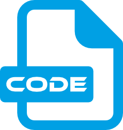

<p align="center">
    
</p>

# ScriptVM - Реализация интерпретируемого скрипт-языка
Простота и однозначность синтаксиса, расширяемость функционала, простота встраивания, минимальный размер, нулевые или минимальные аллокации - основные цели данного пакета.

> **ВАЖНО!** Требует C#9 (или Unity >=2021.2).

> **ВАЖНО!** Проверено на Unity 2021.3 (не зависит от нее) и содержит asmdef-описания для компиляции в виде отдельных сборок и уменьшения времени рекомпиляции основного проекта.

> **ВАЖНО!** Не потокобезопасно в пределах одного экземпляра ScriptVm. Разные экземпляры ScriptVm не конфликтуют при работе в разных потоках.

> **ВАЖНО!** Нет защиты от бесконечной рекурсии.


# Социальные ресурсы
[Официальный блог](https://leopotam.com)


# Установка


## В виде исходников
Поддерживается установка в виде исходников из архива, который надо распаковать в проект.


## Прочие источники
Официальные версии выпускаются для активных подписчиков в виде ссылок на актуальные версии.


## Интеграция в VSCode
Для подсветки синтаксиса можно установить плагин "vscode.vsix" - на вкладке расширений из контекстного меню в заголовке
выбрать `Install from VSIX...` и указать путь до файла. После этого появится возможность выбора языка `ScriptVM` для
корректной работы синтаксиса.


# Основные понятия
Скрипт-язык является интерпретируемым без претензий на быстродействие, не является тьюринг-полным.
Несамостоятелен и предназначен для интеграции в `Хост` - основное приложение,
из которого будет выполнятся вызов функций скрипт-языка.

> **ВАЖНО!** Язык является регистрозависимым.


## Типы
Штатно поддерживаются 3 типа:
* `Number` - float32-число с плавающей точкой. Научная запись числа не поддерживается.
* `String` - набор utf8-символов. Строки ограничиваются одиночными кавычками за исключением случая,
  когда внутри требуется наличие одиночной кавычки - в этом случае допускается использование двойных кавычек.
* `Undefined` - отсутствие данных.

Все новые типы должны реализовываться на хосте с предоставлением соответствующего апи.


## Синтаксис
В качестве разделителя выражений используется перевод строки, `;` не используются в принципе (невозможно написать несколько выражений в одной строке).


### Комментарии
Поддерживаются только однострочные комментарии от символа `#` до конца строки.


### Скрипт-функции
Являются основной атомарной единицей, которую можно выполнить, вызвав из хоста.

Синтаксис функции без параметров можно описать следующей конструкцией:
```bash
FunctionName() {
    # тело функции.
}
```
где `FunctionName` - произвольное уникальное имя, идентифицирующее функцию для дальнейшего вызова из других функций или хоста.

> **ВАЖНО!** Допускается использование любых символов, за исключением `(){},"'` и пробела.

Синтаксис функции с параметрами:
```bash
FunctionName(a, b, c) {
    # тело функции.
}
```
где `a`, `b`, `c` и т.д - параметры, разделенные запятой. Если функция будет вызвана с меньшим количеством параметров,
то недостающие будут инициализированы как `Undefined`.

Вызов функции выполняется следующим образом:
```bash
main() {
    myFunc1(123, 'имя игрока')
}

myFunc1(a, b) {
    # Какая-то логика обработки параметров.
}
```


### Хост-функции
Являются логическими блоками, предоставляемые хостом для их запуска из скрипта. Для работы с ними их сперва надо зарегистрировать (см. "Регистрация хост-функций")


### Переменные
Для использования локальных переменных достаточно присвоить нужной значение через специальную конструкцию:
```bash
fn main() {
    # первый параметр - имя переменной,
    # второй параметр - значение/результат выражения, присваиваемое переменной.
    set x 123
    set y 'строка'
    set z add(x, 456)
}
```
> **ВАЖНО!** Область видимости локальных переменных всегда функция, вложенные блоки не создают новых областей видимости.

> **ВАЖНО!** Для установки глобальных переменных вместо `set` следует использовать `setGlobal`.


### Условное ветвление
Поддерживается ветвление с опциональным `else`-блоком:
```bash
if expr {
    # выражения, которые будут выполнены если условие верно.
}
```
```bash
if expr {
    # выражения, которые будут выполнены если условие верно.
} else {
    # выражения, которые будут выполнены если условие ложно.
}
```
> **ВАЖНО!** `expr` должно быть числом, истина определяется его ненулевым значением.


### Цикл
Поддерживается повторение блока кода нужное количество раз:
```bash
loop x fromExpr, toExpr {
    # выражения, которые выполенны пока fromExpr < toExpr.
}
```
* `x` - произвольное имя переменной-итератора, которая будет содержать актуальное значение итерации внутри тела цикла.
* `fromExpr` - числовое выражение/константа, определяющее стартовое значение итератора.
* `toExpr` - числовое выражение/константа, определяющее конечное выражение итератора (не включая его).

> **ВАЖНО!** Итерации идут от `fromExpr` до `toExpr`, не включая `toExpr`. Значения округляются до целых,
> итерирование идет с шагом `1`. Если `fromExpr` больше `toExpr`, то итерирование идет с шагом `-1`.


### Принудительный выход
Поддерживается раннее прерывание потока выполнения:
```bash
fn main() {
    set x 1
    ret x
    # До этого места выполнение не дойдет.
    set x 2
    ret x
}
```
Так же поддерживается прерывание потока выполнения во вложенных блоках:
```bash
fn main() {
    set x 1
    if x {
        ret x
    }
    # До этого места выполнение не дойдет.
    set x 2
    ret x
}
```


# Интеграция
Весь скрипт-код работает внутри экземпляра класса `ScriptVm`: код нужно загрузить, распарсить и запустить на выполнение.


## Загрузка и парсинг
Скрипт-код хранится в виде исходников и может быть загружен по сети или с диска.
```c#
string code = File.ReadAllText ("Scripts/script1.txt");
ScriptVm vm = new ScriptVm ();
string err = vm.Load (code);
if (err != null) {
    // err содержит текст ошибки с указанием проблемы и места возникновения.
}
```
> **ВАЖНО!** Если код не меняется, достаточно его загрузить один раз, а потом только вызывать нужные функции.

> **ВАЖНО!** При загрузке нового кода старый выгружается.


## Запуск функции
Запускать можно именованные как хост-, так и скрипт-функции, но не отдельные выражения.
Скрипт:
```bash
fn main() {
    # Какая-то логика.
}
```
Загрузка, парсинг и запуск:
```c#
string code ="fn main() {\n# Какая-то логика.\n}";
ScriptVm vm = new ScriptVm ();
string err = vm.Load (code);
if (err != null) {
    return err;
}
(retVal, err) = vm.Run ("main", null);
```
Вызов возвращает результат работы функции и возникшую ошибку, если она произошла.


## Запуск функции с параметрами
В функцию можно передавать параметры, порядок их добавления соответствует порядку аргументов:
```c#
string code ="fn main() {\n# Какая-то логика.\n}";
ScriptVm vm = new ScriptVm ();
string err = vm.Load (code);
if (err != null) {
    return err;
}
ScriptArgs args = vm
    .NewScriptArgs ()
    .AddNum (1.23f)
    .AddNum (4.56f);
(retVal, err) = vm.Run ("main", args);
```
> **ВАЖНО!** После передачи списка аргументов в метод `Run()` он становится невалидным и его нельзя использовать повторно!


## Регистрация хост-функций
В скрипт-языке нет штатных хост-функций, по сути код работает в полностью изолированной пустой песочнице.
Для добавления функционала, доступного внутри скрипт-языка, его следует зарегистрировать в виде хост-функции.
Скрипт:
```bash
fn main() {
    # вызов хост-функции "add" с 2 параметрами.
    return add(1.23, 4.56)
}
```
Запуск:
```c#
string code ="... код скрипта выше...";
ScriptVm vm = new ScriptVm ();
vm.AddFunc ("add", OnAddCall);
string err = vm.Load (code);
if (err != null) {
    return err;
}
(retVal, err) = vm.Run ("main", null);
if (err != null) {
    return err;
}
var (num, ok) = retVal.NumValue ();
if (!ok) {
    // ошибка получения значения как числа (некорректный тип результата).
}
// Результат: num = 5.79
...
// Код хост-функции.
(ScriptVar, string) OnAddCall (ScriptArgs args) {
    // Берем первый аргумент и пытается интерпретировать его как число.
    // В случае несовпадения типа будет возвращен неуспех операции.
    var (arg1, arg1ok) = args.Get (0).NumValue ();
    var (arg2, arg2ok) = args.Get (1).NumValue ();
    if (!arg1ok || !arg2ok) {
        return (ScriptVar.NewUndef (), "add: требуются два числовых параметра");
    }
    return (ScriptVar.NewNum (p1 + p2), null);
}
```
> **ВАЖНО!** Хост-функции должны быть зарегистрированы до загрузки кода, иначе парсер не сможет найти их.

> **ВАЖНО!** Внутри хост-функций нельзя делать вызовы других функций в текущем экземпляре `ScriptVm` через `ScriptVm.Run()`.

> **ВАЖНО!** Внутри хост-функций нельзя делать выгрузку старого и загрузку нового скрипт-кода в текущий экземпляр `ScriptVm` через `ScriptVm.Unload()` / `ScriptVm.Load()`.


# Лицензия
Расширение выпускается под коммерческой лицензией, [подробности тут](./LICENSE.md).
