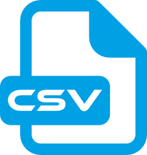

<p align="center">
    
</p>

# CSV Serialization
Поддержка CSV-формата (`C`omma-`S`eparated `V`alues - "значения, разделенные запятыми").

> **ВАЖНО!** Требует C#9 (или Unity >=2021.2).

> **ВАЖНО!** Проверено на Unity 2021.3 (не зависит от нее) и содержит asmdef-описания для компиляции в виде отдельных сборок и уменьшения времени рекомпиляции основного проекта.


# Социальные ресурсы
[Официальный блог](https://leopotam.com)


# Установка


## В виде исходников
Поддерживается установка в виде исходников из архива, который надо распаковать в проект.


## Прочие источники
Официальные версии выпускаются для активных подписчиков в виде ссылок на актуальные версии.


# Валидация
Валидация входящих csv-данных ограничена в угоду простоты и скорости разбора - при вызове любого метода проводится минимальный набор проверок:

* Количество столбцов одинаково во всех строках.
* Количество открываемых кавычек равно количеству закрывающих (включая вложенные удвоенные с учетом переводов строк).

> **ВАЖНО!** Не проверяется правильность последовательности удваивающихся кавычек (что между ними нет других символов), учитывается только их количество.


# Чтение таблицы
Поддерживается чтение данных в набор записей, состоящих из строк (прямоугольную таблицу).

Таблица с данными:

|    |    |    |
|----|----|----|
| 11 | 12 | 13 |
| 21 | 22 | 23 |

```c#
string csv = "...csv данные...";
// Нужно ли преобразовывать пару символов "\n" в реальный перевод строки.
bool normalizeNewLines = true;
(List<List<string>> table, bool ok) = CsvReader.ParseTable (csv, normalizeNewLines);
if (ok) {
    // table содержит разобранные данные из csv.
    // table[0][0] == "11"
    // table[0][2] == "13"
    // table[1][0] == "21"
}
```
Может использоваться для чтения табличных данных и представления их в виде списка списков.

# Чтение словаря значений 
Поддерживается чтение значений в набор пар "Ключ/Значение". Первый столбец считается ключом, второй - значением, остальные игнорируются.

Таблица с данными:

|    |    |    |
|----|----|----|
| 11 | 12 | 13 |
| 21 | 22 | 23 |

```c#
string csv = "...csv данные...";
// Нужно ли преобразовывать пару символов "\n" в реальный перевод строки.
bool normalizeNewLines = true;
(Dictionary<string, string> dict, bool ok) = CsvReader.ParseKeyedValues (csv, normalizeNewLines);
if (ok) {
    // dict содержит разобранные данные из csv.
    // dict["11"] == "12"
    // dict["21"] == "22"
}
```
Может использоваться для чтения настроек, имеющих уникальные имена (ключи).

# Чтение словаря списков
Поддерживается чтение списков в набор пар "Ключ/Значение". Первый столбец считается ключом, остальные - значением (списком).

Таблица с данными:

|    |    |    |
|----|----|----|
| 11 | 12 | 13 |
| 21 | 22 | 23 |

```c#
string csv = "...csv данные...";
// Нужно ли преобразовывать пару символов "\n" в реальный перевод строки.
bool normalizeNewLines = true;
(Dictionary<string, List<string>> dict, bool ok) = CsvReader.ParseKeyedLists (csv, normalizeNewLines);
if (ok) {
    // dict содержит разобранные данные из csv.
    // dict["11"][0] == "12"
    // dict["11"][1] == "13"
    // dict["21"][1] == "23"
}
```
Может использоваться для локализации, где первый столбец - ключи, а все последующие - переводы на разные языки.

# Лицензия
Расширение выпускается под коммерческой лицензией, [подробности тут](./LICENSE.md).
