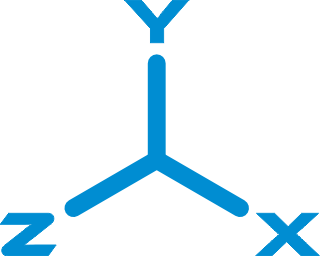

    

# Набор типов для отвязки математики от движка

> **ВАЖНО!** Требует C#9 (или Unity >=2021.2).

> **ВАЖНО!** Не забывайте использовать `DEBUG`-версии билдов для разработки и `RELEASE`-версии билдов для релизов: все внутренние проверки/исключения будут работать только в `DEBUG`-версиях и удалены для увеличения производительности в `RELEASE`-версиях.

> **ВАЖНО!** Проверено на Unity 2021.3 (не зависит от нее) и содержит asmdef-описания для компиляции в виде отдельных сборок и уменьшения времени рекомпиляции основного проекта.

# Социальные ресурсы
[Официальный блог](https://leopotam.com)

# Установка

## В виде исходников
Поддерживается установка в виде исходников из архива, который надо распаковать в проект.

## Прочие источники
Официальные версии выпускаются для активных подписчиков в виде ссылок на актуальные версии.

# Основные типы

> **ВАЖНО!** Значения, представляющие собой углы поворота, всегда передаются и принимаются в радианах.

* **Beam3** - аналог `Ray` в `Unity`.
* **Box2f** - аналог `Bounds` в `Unity` для 2D пространства.
* **Box3f** - аналог `Bounds` в `Unity`.
* **Fix32** - фиксированная математика формата 16.16, аналог float.
* **Flat** - аналог `Plane` в `Unity`.
* **MathFast.XXX** - аналог `Mathf` в `Unity`.
* **Quat** - аналог `Quaternion` в `Unity`.
* **Rng** - реализация генератора псевдослучайных чисел на базе xxHash с возможностью получения значения с любой итерации.
* **Vec2f** - аналог `Vector2` в `Unity`.
* **Vec2i** - аналог `Vector2Int` в `Unity`.
* **Vec3f** - аналог `Vector3` в `Unity`.
* **Vec3i** - аналог `Vector3Int` в `Unity`.

# Лицензия
Расширение выпускается под коммерческой лицензией, [подробности тут](./LICENSE.md).
